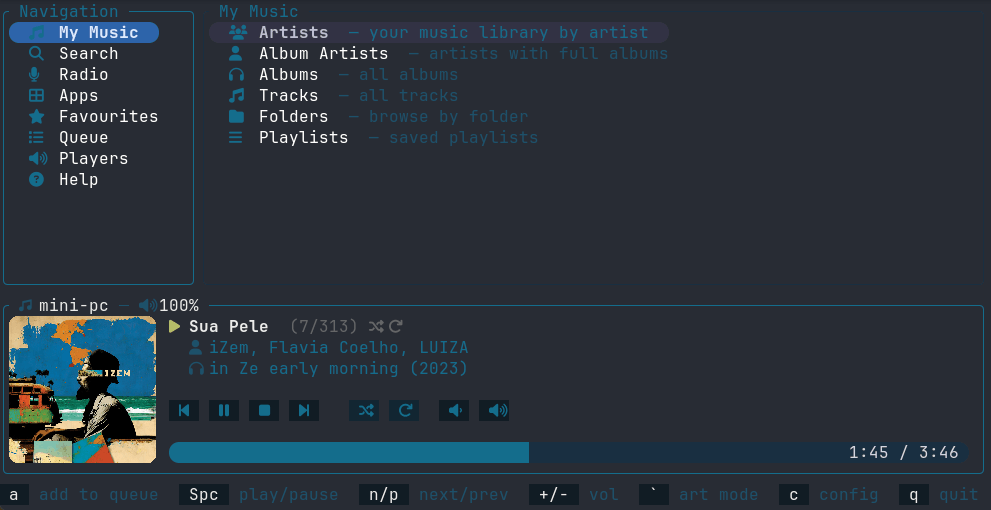
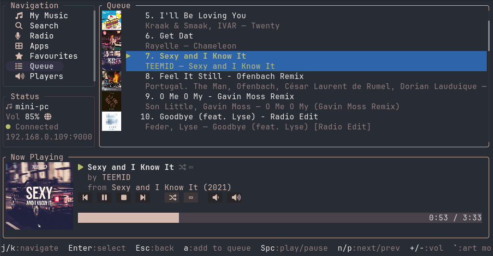
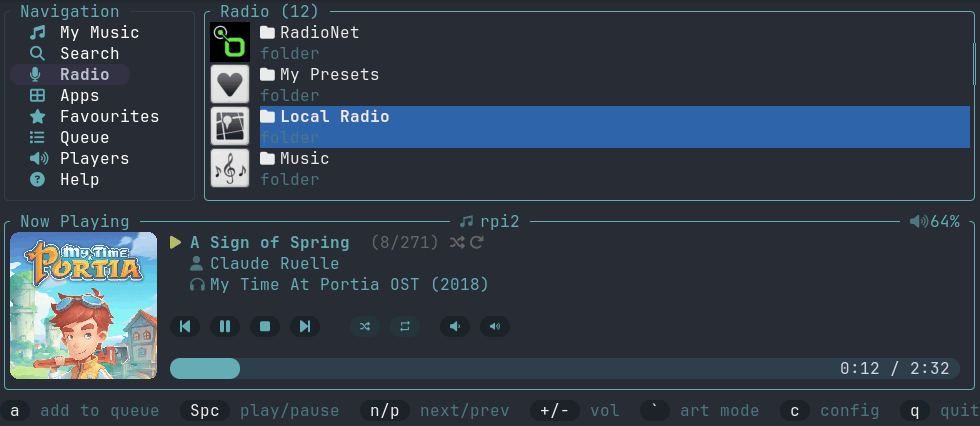
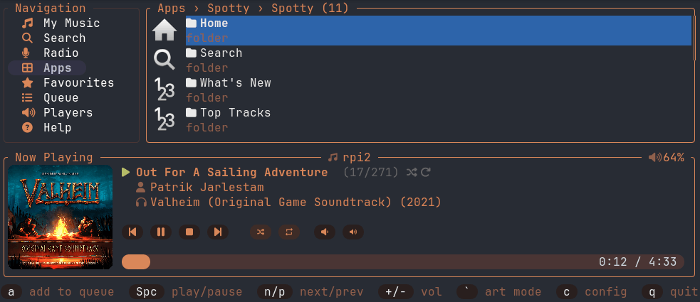
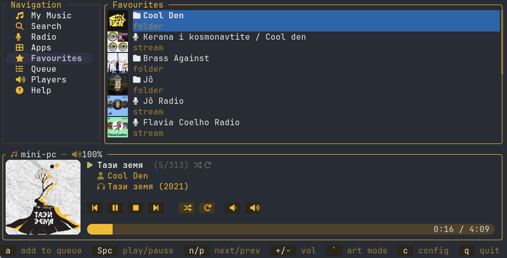
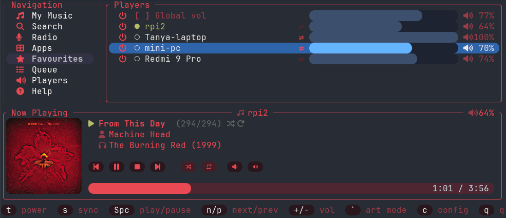
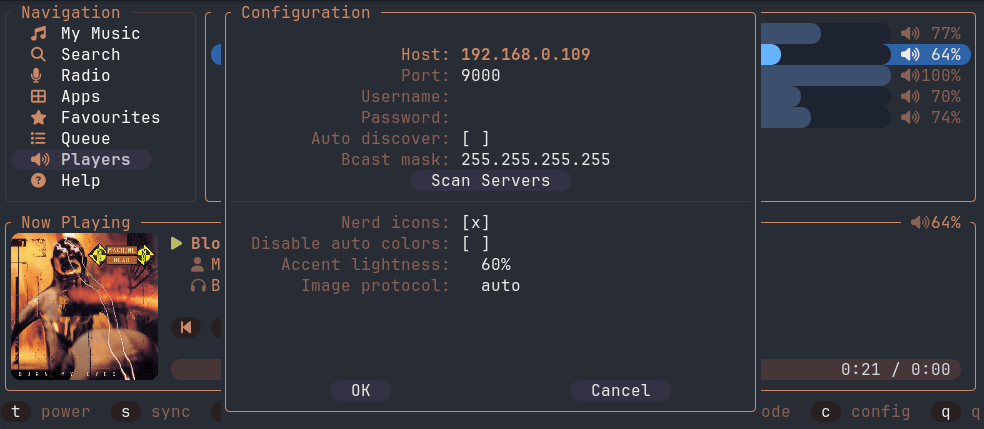
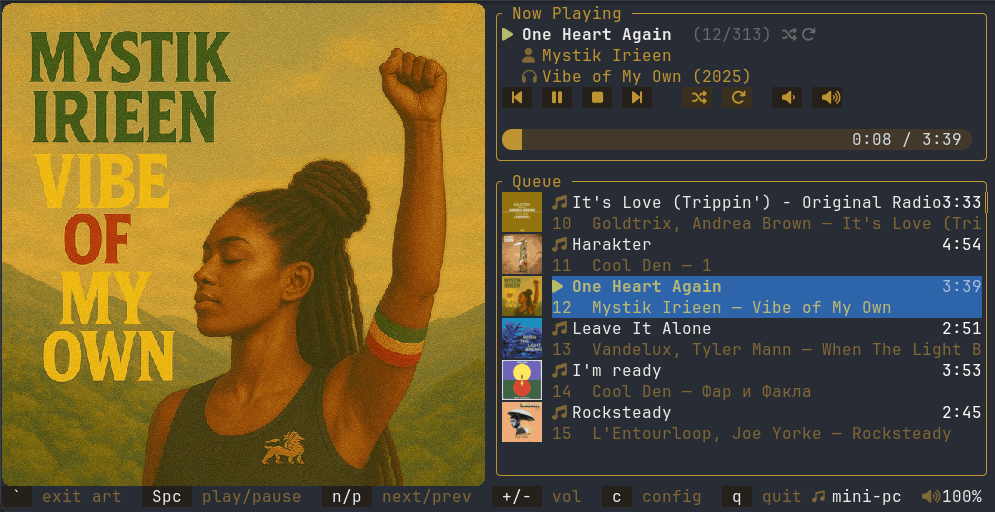

# lyrtui

A keyboard-driven terminal UI for [Lyrion Music Server](https://lyrion.org/) (formerly Logitech Media Server / Squeezebox Server), written in Rust.

## Screenshot



<details>
  <summary>Show more screenshots</summary>
  
  
  
  
  
  
  
</details>

## Features

- Browse your music library: Artists → Albums → Tracks, or jump straight to All Tracks
- **Search** your music library (artists, albums, tracks, playlists) — type a query, press Enter, then drill in or play results directly
- Browse and play internet radio via Lyrion's radio services (TuneIn, etc.) with full hierarchical navigation
- Browse and play installed Lyrion apps (Spotify, Deezer, Bandcamp, etc.) with the same hierarchical navigation — shows a **Loading...** indicator while fetching remote content so navigation never blocks
- View and jump to items in the playback queue
- Select and switch between multiple players; toggle player power on/off
- **Player sync** — click the `⇄` sync button next to any player in the Players view to open a sync modal; check/uncheck other players to join or leave a sync group; confirms or cancels with keyboard or mouse
- **Global volume control** — toggle a persistent checkbox in the Players view to make `+`/`-` adjust all players simultaneously from any screen; a globe icon (◎) appears in the status panel when active
- Playback controls: play/pause, next, previous, volume up/down (keyboard and clickable buttons)
- Toggle **shuffle** (`s`) and cycle **repeat** modes (`r`): off → one → all → repeat-all
- Expanded now-playing panel with album art that **dynamically fills the available height** — the Now Playing bar scales to ~1/3 of the terminal height so the cover art grows when you expand your terminal (supports Kitty, Sixel, iTerm2, and halfblock protocols — auto-detected)
- **Adaptive theme** — accent color is auto-generated from the current track's album art and applied to the progress bar and UI borders
- Live now-playing bar with progress and volume display
- Scrollbar in the navigation panel for long lists
- In-app server configuration with full mouse support — changes apply immediately without restart
- **Auto-discovery** — automatically finds a Lyrion server on the local network via UDP broadcast on startup; open config (`c`) and press **[ Scan Servers ]** to discover all available servers and pick one from the list
- Optional **Nerd Font icons** throughout the UI (toggle in config)
- Add any selected track, album, artist, or radio stream to the queue with `a` (non-destructive append)
- In-app help screen listing all keyboard shortcuts
- Graceful reconnection when the server is unreachable

## Requirements

- A running [Lyrion Music Server](https://lyrion.org/) instance (default: `localhost:9000`)
- (Optional) A terminal that supports one of: Kitty graphics protocol, Sixel, iTerm2 inline images, or Unicode halfblocks (fallback — works everywhere)
- (Optional) A [Nerd Font](https://www.nerdfonts.com/) for icon support

## Installation

### Install via cargo

```sh
cargo install lyrtui
```

### Install prebuilt binaries via Homebrew

```sh
brew install hjelev/tap/lyrtui
```

### Build from source
```sh
git clone https://github.com/hjelev/lyrtui
cd lyrtui
cargo build --release
# binary at: target/release/lyrtui
```
### Use the installer from the releases page

[releases page](https://github.com/hjelev/lyrtui/releases) and run it. This will place the `lyrtui` binary in your system's PATH.

## Usage

```sh
lyrtui
```

On first launch, lyrtui broadcasts a UDP discovery packet to find a Lyrion server on the local network. If discovery fails or the server is on a different subnet, press `c` to open the configuration menu and set the correct host and port. Settings are saved to `~/.config/lyrtui/config.toml`.

### Command-line options

| Flag | Description |
|------|-------------|
| `-h`, `--help` | Print help and exit |
| `-v`, `--version` | Print version and exit |
| `-i`, `--info` | Print saved config and live server/player info, then exit |
| `-p`, `--play-pause` | Toggle play/pause on the default player |
| `--next` | Skip to the next track |
| `--prev` | Go to the previous track |

The playback flags (`-p`, `--next`, `--prev`) target the `default_player` from config, or the first available player if none is set. They print the affected track name and exit without opening the TUI — useful for binding to media keys or shell aliases.

### Mouse support

- **Left click** on a sidebar item — navigate to that section
- **Left click** on the `⇄` sync button next to a player (Players view) — opens the sync modal to manage that player's sync group
- **Left click** on a playable item (track, radio stream, queue entry) — opens an action menu:
  - **Play now** — immediately start playing
  - **Play next** — insert after the current track
  - **Add to end of queue** — append to the queue
  - **Add to favourites** — save to LMS favourites
  - **Add [album/folder] to queue** — add the whole parent album or radio/app/favourites folder (shown when applicable)
- **Double-click** on a playable item — play immediately (skips the menu)
- **Left click** on a navigable item (artist, album, radio folder) — navigate into it (unchanged)
- **Left click** on the volume `−` / `+` buttons in the now-playing bar — adjust volume
- **Left click** on the shuffle or repeat buttons — toggle/cycle playback mode
- **Right click** anywhere — go back (same as `Esc` / `h`)
- **Scroll wheel** — scroll the list under the cursor

The action menu can be navigated with `↑`/`↓` (or `j`/`k`), confirmed with `Enter`, and dismissed with `Esc` or a click outside.

### Keyboard shortcuts

| Key | Action |
|-----|--------|
| `j` / `↓` | Move down |
| `k` / `↑` | Move up |
| `PgDn` | Jump down 10 items |
| `PgUp` | Jump up 10 items |
| `Home` | Jump to top of list |
| `End` | Jump to bottom of list |
| `Enter` / `l` | Select / navigate; opens action menu on playable items |
| `Esc` / `h` / `←` | Back / focus sidebar |
| `Space` | Play / pause |
| `n` | Next track |
| `p` | Previous track |
| `+` / `=` | Volume up |
| `-` | Volume down |
| `s` | Toggle shuffle |
| `r` | Cycle repeat mode (off → one → all → repeat-all) |
| `a` | Add selected item to queue |
| `d` / `Del` | Remove selected item from queue |
| `x` | Clear queue |
| `[` / `]` | Cycle search scope prev / next (in Search view) |
| `t` | Toggle player power (in Players view) |
| `Space` | Toggle sync checkbox (in sync modal) |
| `Tab` | Switch focus between player list and buttons (in sync modal) |
| `c` | Open server configuration |
| `` ` `` | Toggle Big Art Mode |
| `q` / `Ctrl-c` | Quit |

### Configuration

The config file lives at `~/.config/lyrtui/config.toml`:

```toml
host = "localhost"
port = 9000
default_player = ""          # optional: player ID to select on startup
use_nerd_icons = false       # set to true if your terminal uses a Nerd Font
auto_discover = true         # broadcast UDP to find LMS on startup
broadcast_mask = "255.255.255.255"  # subnet for discovery broadcast
global_volume_control = true # enable global volume control (globe icon in status panel when active)
full_art_mode = false        # start in big art mode 
disable_auto_colors = false  # disable adaptive theme colors extracted from album art
username = ""                # optional: LMS HTTP basic auth username
password = ""                # optional: LMS HTTP basic auth password
```

You can edit this file directly or use the in-app config menu (`c`). Inside the menu, move between fields with the arrow keys (`↑`/`↓` or `←`/`→`) or `Tab`, press `Enter` to edit a field or toggle a setting, and click any field with the mouse. On the image-protocol selector, `←`/`→` cycle the value.

#### Auto-discovery

When `auto_discover = true` (the default), lyrtui sends a SLIM-protocol UDP broadcast on port 3483 at startup. The first responding server's IP is used automatically, overriding the configured `host`. Set `broadcast_mask` to a subnet address (e.g. `192.168.1.255`) if your server is on a different interface.

#### Nerd Font icons

Set `use_nerd_icons = true` to enable Nerd Font glyphs in the sidebar, now-playing bar, search box, and library lists (artist/album icons and volume indicator). Requires a [Nerd Font](https://www.nerdfonts.com/) installed in your terminal.

#### Adaptive theme

lyrtui extracts a dominant color from the current track's album art and uses it as the accent color for the progress bar, UI borders, and scrollbars. No configuration required — it updates automatically when the track changes.

## Architecture

```
main.rs       — terminal init, event loop, action dispatch
app.rs        — all mutable state; AppMsg channel types
ui.rs         — pure ratatui rendering (no async, no side effects)
api.rs        — all JSON-RPC calls via reqwest
events.rs     — crossterm key events → Action enum
handlers.rs   — action handlers; mouse event routing
background.rs — background polling task (now-playing, queue sync)
config.rs     — TOML config load/save
discovery.rs  — UDP broadcast discovery for LMS servers
utils.rs      — shared helpers
```

Network I/O runs in background `tokio` tasks and communicates with the UI via `mpsc` channels. The render loop never blocks on I/O.

## Development

```sh
cargo run           # run with debug build
cargo test          # run tests
cargo clippy -- -D warnings   # lint
cargo fmt           # format
```
