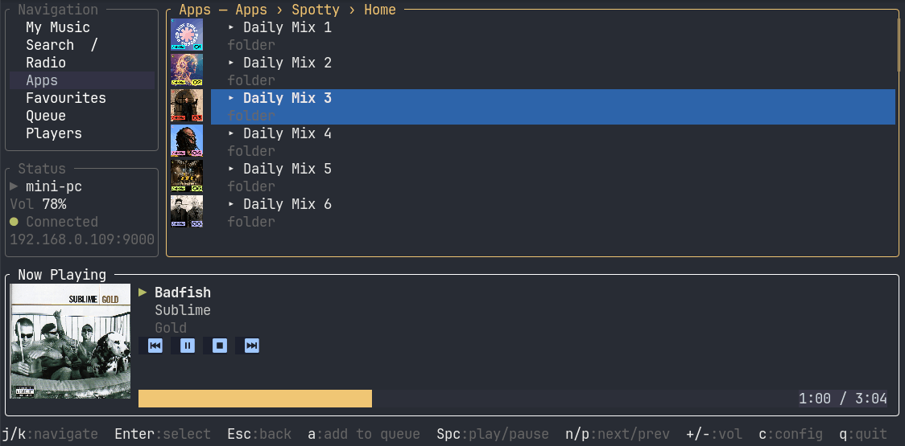

# lyrtui

A keyboard-driven terminal UI for [Lyrion Music Server](https://lyrion.org/) (formerly Logitech Media Server / Squeezebox Server), written in Rust.

## Screenshot



## Features

- Browse your music library: Artists → Albums → Tracks, or jump straight to All Tracks
- **Search** your music library (artists, albums, tracks, playlists) — type a query, press Enter, then drill in or play results directly
- Browse and play internet radio via Lyrion's radio services (TuneIn, etc.) with full hierarchical navigation
- Browse and play installed Lyrion apps (Spotify, Deezer, Bandcamp, etc.) with the same hierarchical navigation
- View and jump to items in the playback queue
- Select and switch between multiple players; toggle player power on/off
- Playback controls: play/pause, next, previous, volume up/down
- Expanded now-playing panel with album art (supports Kitty, Sixel, iTerm2, and halfblock protocols — auto-detected)
- Live now-playing bar with progress and volume display
- In-app server configuration — changes apply immediately without restart
- Add any selected track, album, artist, or radio stream to the queue with `a` (non-destructive append)
- In-app help screen listing all keyboard shortcuts
- Graceful reconnection when the server is unreachable

## Requirements

- A running [Lyrion Music Server](https://lyrion.org/) instance (default: `localhost:9000`)
- Rust toolchain (1.80+ recommended, uses the 2024 edition)
- A terminal that supports one of: Kitty graphics protocol, Sixel, iTerm2 inline images, or Unicode halfblocks (fallback — works everywhere)

## Installation

```sh
git clone https://github.com/yourname/lyrtui
cd lyrtui
cargo build --release
# binary at: target/release/lyrtui
```

## Usage

```sh
lyrtui
```

If the server is not on `localhost:9000`, press `c` to open the configuration menu and set the correct host and port. Settings are saved to `~/.config/lyrtui/config.toml`.

### Mouse support

- **Left click** on a sidebar item — navigate to that section
- **Left click** on a playable item (track, radio stream, queue entry) — opens an action menu:
  - **Play now** — immediately start playing
  - **Play next** — insert after the current track
  - **Add to end of queue** — append to the queue
  - **Add to favourites** — save to LMS favourites
  - **Add [album/folder] to queue** — add the whole parent album or radio/app/favourites folder (shown when applicable)
- **Double-click** on a playable item — play immediately (skips the menu)
- **Left click** on a navigable item (artist, album, radio folder) — navigate into it (unchanged)
- **Right click** anywhere — go back (same as `Esc` / `h`)
- **Scroll wheel** — scroll the list under the cursor

The action menu can be navigated with `↑`/`↓` (or `j`/`k`), confirmed with `Enter`, and dismissed with `Esc` or a click outside.

### Keyboard shortcuts

| Key | Action |
|-----|--------|
| `j` / `↓` | Move down |
| `k` / `↑` | Move up |
| `Enter` / `l` | Select / navigate; opens action menu on playable items |
| `Esc` / `h` / `←` | Back / focus sidebar |
| `Space` | Play / pause |
| `n` | Next track |
| `p` | Previous track |
| `+` / `=` | Volume up |
| `-` | Volume down |
| `a` | Add selected item to queue |
| `t` | Toggle player power (in Players view) |
| `c` | Open server configuration |
| `?` (Help sidebar) | Show all keyboard shortcuts |
| `q` / `Ctrl-c` | Quit |

### Configuration

The config file lives at `~/.config/lyrtui/config.toml`:

```toml
host = "localhost"
port = 9000
default_player = ""   # optional: player ID to select on startup
```

You can edit this file directly or use the in-app config menu (`c`).

## Architecture

```
main.rs     — terminal init, event loop, action dispatch
app.rs      — all mutable state; AppMsg channel types
ui.rs       — pure ratatui rendering (no async, no side effects)
api.rs      — all JSON-RPC calls via reqwest
events.rs   — crossterm key events → Action enum
config.rs   — TOML config load/save
```

Network I/O runs in background `tokio` tasks and communicates with the UI via `mpsc` channels. The render loop never blocks on I/O.

## Development

```sh
cargo run           # run with debug build
cargo test          # run tests
cargo clippy -- -D warnings   # lint
cargo fmt           # format
```
